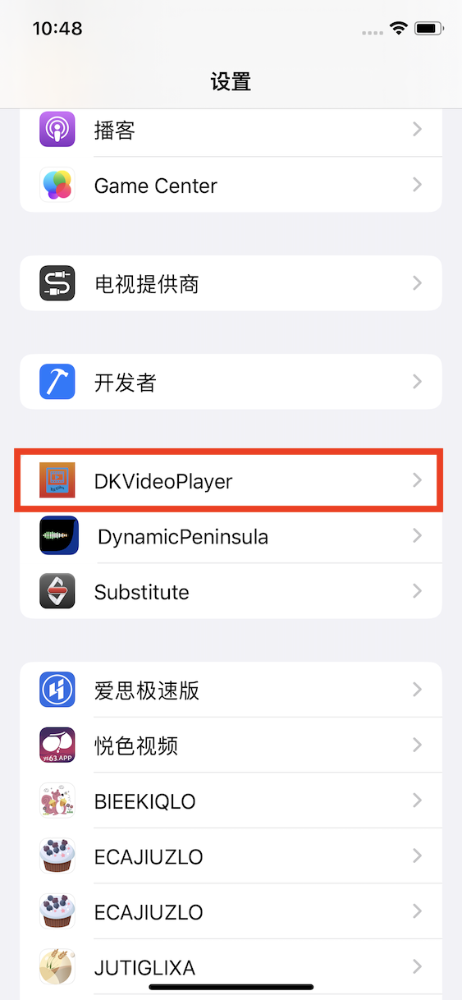
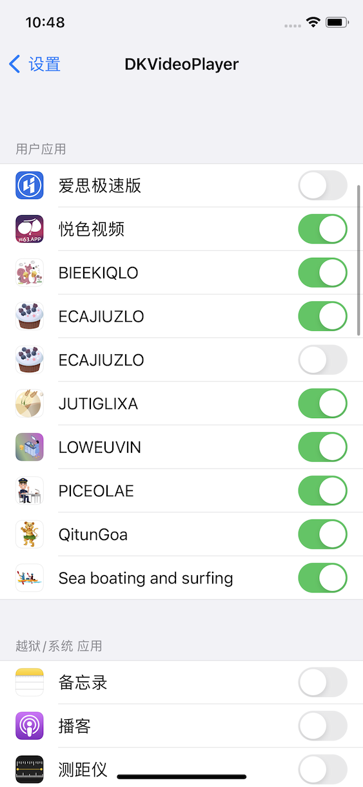

DKVideoPlayer  
===  
一款可以获取视频类APP和直播类APP播放地址的插件。  

 **更多介绍[前往查看📲](https://iosre.com/t/%E4%BB%8A%E5%A4%A9%E5%85%A8%E5%9C%BA%E7%9A%84%E6%B6%88%E8%B4%B9%E7%94%B1%E8%B5%B5%E5%85%AC%E5%AD%90%E4%B9%B0%E5%8D%95%EF%BC%81/22005)**    

#### 可以做什么？ 
本项目支持大部分🔞视频类APP和直播类APP， 
 * [x] 获取播放地址直接播放视频。   
 * [x] 解除直播录屏限制  
 * [x] 获取直播rtmp地址  
 * [x] 在原应用内播放限制视频  
 * [x] 一键复制视频地址   
 * [x] 自定义选择需要注入应用  
 * [x] 一次安装多APP同时注入  

 #### 支持那些应用：
 大部分视频类APP和直播类APP，具体前往issue查看或添加 [前往查看📲](https://github.com/DKJone/DKVideoPlayer/issues/1)  

#### 安装方式(越狱)：   
##### 一：源代码安装    
    下载本项目使用xcode安装到越狱手机，需要安装monkeyDev  

##### 二：添加越狱源安装   
    添加`https://dkjone.github.io`到Cydia或者sileo，选择dkVideoPlayer安装
    注意：本插件越狱安装时需要依赖 `PreferenceLoader`和`AppList` ,请确保先安装了这两个依赖库
    
##### 三：下载deb文件安装   
[网盘下载 deb-0.1.0](https://url15.ctfile.com/f/24576815-863624277-4b1308?p=dkjone)

#### 使用方法    
1、在设置中找到 dkvideoPlayer 打开你需要注入的应用开关   

| 设置 | 开关 |  
|:-:|:-:|  
|||  

2、重新打开需要注入的应用，看到和系统辅助触控类似的小白点按钮表示注入成功  

3、点击需要观看的视频或者直播间，点击小白点-解析视频即可打开自定义播放页面无限制播放直播或视频，并可截图或录屏、需要退出自定义播放器可以点击小白点-退出解析

4、复制视频地址：点击小白点-复制地址或者解析视频后点击最上方复制地址按钮  

5、切换播放的服务器地址，仅对视频类应用有用，直播类服务器地址无法更换  

